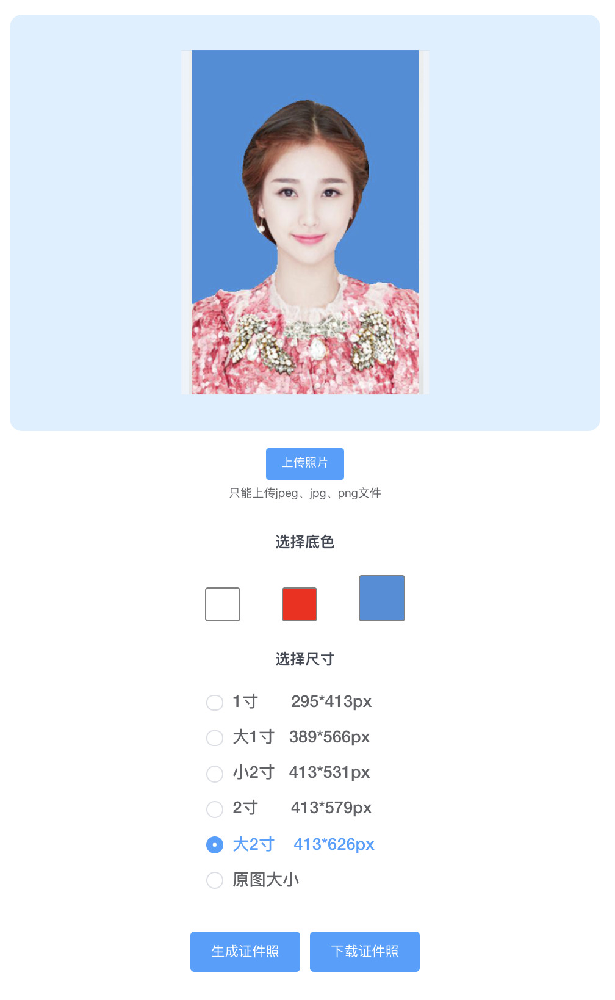

# 完全免费的智能证件照服务
我在2021年软考报名时，报名系统要求提交白色背景的大头照。我用人工智能图像人脸识别技术和图像语义分割技术，制作了一个符合要求的大头照。  
该功能十分有用，我把该功能开发成了一个web小应用，分享出来免费使用。 

访问地址：https://actboy.github.io/ai-id-photo/#/id-photo

  

应用到了深度学习框架tensorflow和paddlepaddle， 
实现方案见[《ai十行代码制作证件照》](./sln/docs/README.md)。