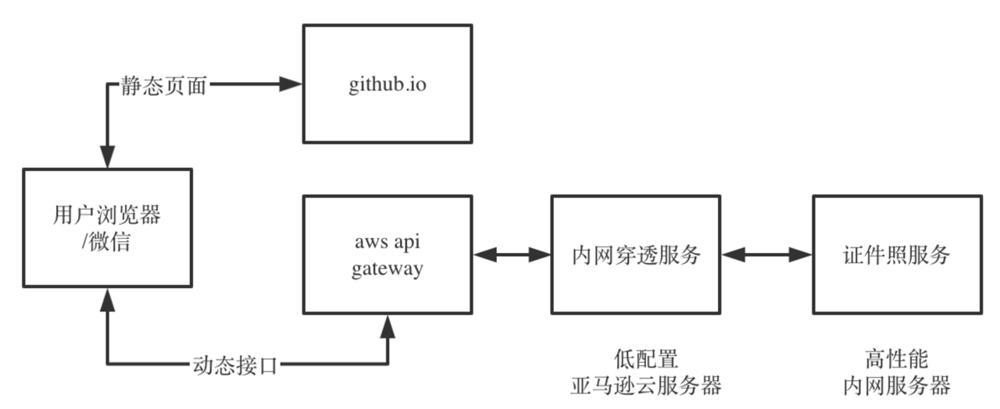

# 完全免费的智能证件照服务(零成本构建动态网站/小程序)
我在2021年软考报名时，报名系统要求提交白色背景的大头照。我用人工智能图像人脸识别技术和图像语义分割技术，制作了一个符合要求的大头照。  
该功能十分有用，我把该功能开发成了一个web小应用，分享出来免费使用。 

访问地址：https://actboy.github.io/ai-id-photo/#/id-photo

  

网站前端代码我找朋友帮忙开发。后端代码用python 3.7.11开发，应用到了深度学习框架tensorflow和paddlepaddle， 算法原理及代码参见《》。  

软件开发搞定了，但是部署web应用需要服务器、域名、ssl证书等资源。我选择亚马逊云服务器、亚马逊API网关、github.io等免费资源，  
让用户体验与收费服务完全一致，浏览器、微信均可以访问。可按照本文思路，构建其他零成本动态网站、小程序供互联网用户使用。

1. github.io部署静态页面；
2. 内网服务器部署证件照服务；
3. 申请免费亚马逊云服务器；
4. 在亚马逊服务器上搭建内网穿透服务LanProxy；
5. 注册aws gateway服务。

github.io部署静态页面，解决无域名问题。

aws api gateway解决跨域问题以及无ssl证书问题。

内网穿透服务是为是互联网能访问部署在内网的接口（服务）。

证件照服务特别消耗资源，内网服务器性能比亚马逊免费服务器性能好很多，所以选择证件照服务部署在内网服务器上。