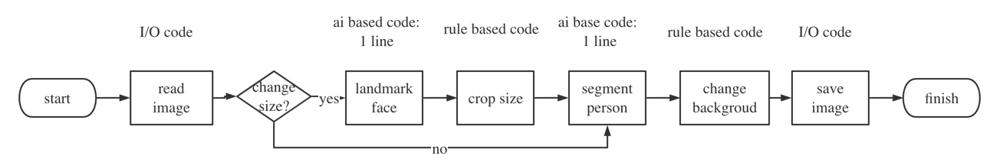

# ai十行代码制作证件照
我们经常会遇到这样的问题，报名参加考某种考试，
需要提交符合指定背景、尺寸要求的照片，但是手上只有生活中，或者照片尺寸符合要求，但是背景不符合要求的情况。
今天我教大家用ai技术制作证件照，其关键代码不足10行。

  
1. read image节点，使用PIL库的Image对象的Open方法打开图片
```
Image.open(fp)
```
2. chage size节点，使用if……else判断语句
3. landmark face节点，使用paddlepaddle深度学习框架，调用模型face_landmark_localization推理
```
face_landmark = hub.Module(name="face_landmark_localization")
result = face_landmark.keypoint_detection(images=[np.array(raw_img)])
face = np.array(result[0]['data'][0], dtype=np.int64)
```
4. crop size节点，依据步骤3人脸轮廓，根据人脸裁剪一定大小的图片
```
face[:, 0].min()
right = face[:, 0].max()
w = right - left
cw = (right+left) // 2

upper = face[:, 1].min()
lower = face[:, 1].max()
# h = lower - upper
ch = (lower + upper) // 2

h = crop_size[1] * w // crop_size[0]

box = (cw - rate * w, ch-rate * h, cw + rate * w, ch + rate * h)

cropped_img = raw_img.crop(box)
```
5. segment person节点，使用tensorflow深度学习框架，调用模型DeepLab推理
```
resized_image, seg_map = model.run(img)  # model为DeepLabV3
```
6. change backgroud节点，使用opencv库，对非人物区域进行膨胀操作，然后修改非人物区间rgb值
```
person = []
mask = np.array((mask < 180), dtype=np.uint8)
mask = cv.dilate(mask, None, iterations=2)
mask = np.array(mask, dtype=np.bool)
for i in range(3):
    a = img[i]
    a[mask] = rgb[i]
    person.append(a)

img = np.array(person).transpose((1, 2, 0))
new_image = Image.fromarray(img)
std_new_img = new_image.resize(std_size, Image.ANTIALIAS)
```
7. save image节点，使用PIL库的Image对象的save方法保存图片
```
img2.save(out_path + file_name)
```
该功能的完整代码参考：https://github.com/actboy/ai-id-photo/blob/master/src/algo/precision_id_photo.py

## demo
该功能十分有用，我把该功能开发成了一个web小应用，分享出来免费使用。 

访问地址：https://actboy.github.io/ai-id-photo/#/id-photo

## todo：
1. 训练face_landmark_localization模型
2. 训练DeepLabV3模型